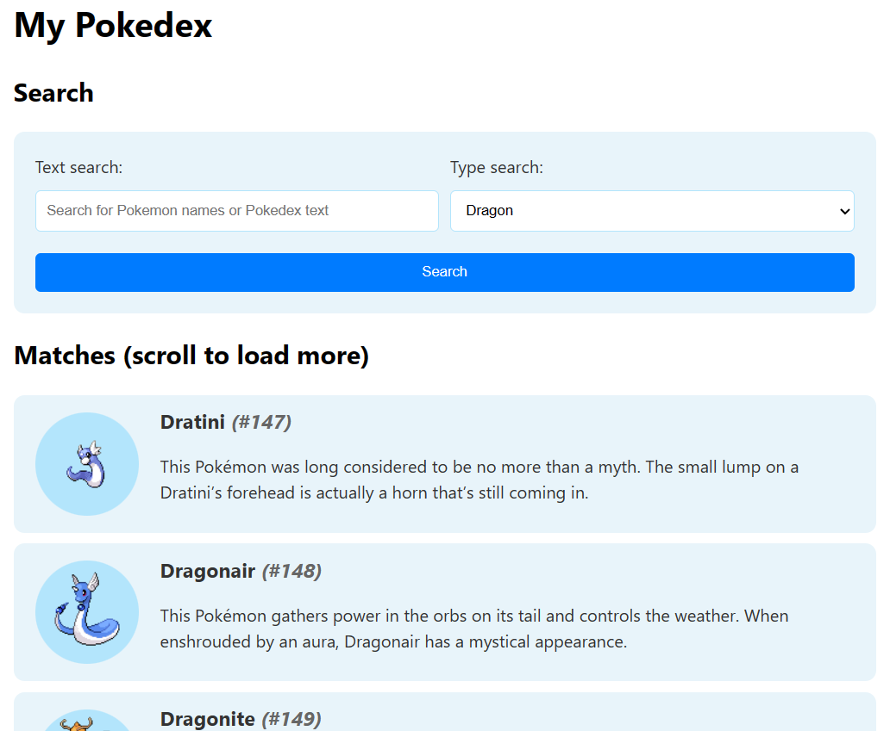

# COMPSCI 732 / SOFTENG 750 Practical Test - How Many Pokémon Apps Can One Course Have??? 😕

In this practical test, you'll demonstrate your skill in all aspects of MERN-stack development, from implementing a simple MongoDB database schema, to writing a non-trivial API route, to writing frontend code to interact with that route, to styling the frontend to make it your own.

This test will have you dive a little deeper into the `mongoose` / MongoDB documentation, as a research component, to enable features such as full-text search and pagination.

The test is worth **15%** of your final grade for the course. It is expected to be completed **individually**. Detected instances of plagiarism will result in 0 marks for the test, and potential disciplinary action (but you _are_ allowed to use AI tools - see below).

Your final commit to `main` as of the due date will be considered as your submission (but there must be evidence of other branches / PRs in your repo history too - see below). Commits after the due date will be ignored.

In addition, please **do not make any of this code public, even after you have completed the course**. It takes an enormous amount of effort to prepare assessment materials like this, and making the code available publically will significantly hamper our ability to reuse any of it.

To complete the test, please follow the tasks below. Each task is given an indicative weighting towards the overall test grade.

## Prerequisites

You will need the [MongoDB Community Server](https://www.mongodb.com/try/download/community), as well as [**npm / node.js**](https://nodejs.org/en) installed on your machine. Development on Mac or Windows should be fine.

Remember to install dependencies for both the frontend and backend.

## Unit testing

The _backend_ has some Jest unit tests provided, which can be run using `npm test` in the `backend` folder (after installing dependencies). As you proceed with the backend tasks, more and more of these tests should pass. Have a look at `backend/src/routes/api/__tests__/` for details.

## Important: Required Git usage

It is **required** that you create a git branch for each task below, and merge it into `main` using a pull request once that task is complete. **If the markers do not see evidence of this in your repository, you will be heavily penalized, by up to 50% of the marks for that task**.

As a bonus, this will help prevent you from breaking a working version of your code from a previous task, with incomplete code from a subsequent task.

## Task Zero - Usage of AI tools (0%, but _please answer this at the end!!_)

AI tools such as ChatGPT, Copilot etc. are **allowed**, and will not negatively affect your marks for this test in any way (though of course you _do not have to use them_ if you don't want to!).

In return, after you have completed the test, please write in the space below, where and how you used the tools, how useful they were, and whether they introduced any unforeseen difficulties:

```
1. In task 4, I didn't know how to provide optional query parameters. Specifically, I don't know whether I should create multiple back-end routes for each of these possibilities, (i.e., one for routes with type as a parameter, one for routes with text as a parameter, and one for both.) Or is there a way to write a route that can flexibly handle multiple optional parameters with only one route. So I asked chatGPT and I found an implementation of the latter one.
2. in task 6, chatGPT gneerated couple of css files that make the webpage more beautiful and clear.
3. in task 8, GPT helped me with implementing the infinite scroll. It helped me realise some details that I didn't notice, e.g. reset the page to 0 when user click the search button... To be honest, I don't think I can implement the 8th task without its help.
```

## Task One - Species schema and database population _(backend)_ - 10%

In this task, create and appropriate export a `mongoose` schema for a `Species` of Pokémon. Each `Species` should have:

- A `dexNumber` (number, required, unique)
- A `name` (string, required, unique)
- An `image` (string, required)
- A `dexEntry` (string, required)
- An array of `types` (each one is a string, and should _only_ be one of the values specified in the backend's `src/data/types.js` file).

In preparation for future tasks, a _text index_ should also be set up on the `name` and `dexEntry` fields, to allow for MongoDB's full-text search functionality. This can be done by adding the following line of code, assuming you named your `Schema` variable `speciesSchema`:

```js
speciesSchema.index({ name: "text", dexEntry: "text" });
```

Once this task is complete, the `npm` task `init-db` - which runs the program located at `src/data/init-db.js` - should run successfully and populate the database with information on just over 900 species of Pokémon. You can check the backend `.env` file to see the database connection string. You can check the database in MongoDB Compass to see that it was populated correctly.

If you need to change this connection string **for any reason**, please change the text below to let us know:

```
I HAVE NOT changed the database connection string in .env
```

## Task Two - Basic species endpoint _(backend)_ - 5%

In this task, create an express endpoint in `src/routes/api/api-species.js`. On a `GET` request to `/api/species`, a JSON array of all `Species` in the MongoDB database should be returned.

## Task Three - Loading species _(frontend)_ - 10%

In this task, at the marked location within `App.jsx` on the frontend, load the species array from your backend into the `species` stateful value.

Once this task is complete, when running both your frontend and backend with a populated database (i.e. after running `init-db` first), you should be able to see the species list displayed in the browser. The component which does this - `SpeciesList` - is already provided to you.

## Task Four - Adding search query parameters _(backend)_ - 20%

In this task, modify your `/api/species` backend route, as follows:

1. The route should accept an _optional_ query parameter, named `type`. If provided, the route will only return species whose `types` array contains the provided `type`.

2. The route should accept another _optional_ query parameter, named `text`. If provided, the route will only return species whose `dexEntry` and / or `name` fields match the given `text` search, using MongoDB's full-text search functionality. If you setup the text index correctly in Task One, then this text search can be performed using the [`$text`](https://www.mongodb.com/docs/manual/reference/operator/query/text/#mongodb-query-op.-text) expression as part of a query filter (you might need to check the docs linked here to see how this works).

3. If _both_ query parameters are provided, the route will return only species who match both searches.

**Note:** The full-text search functionality will only do whole-word matches. So, for example, searching for "bulb" won't return "Bulbasaur". It _is_ case-insensitive by default though, so searching for "bulbasaur" _will_ return "Bulbasaur".

**Note 2:** The `dexNumber` ascending ordering won't necessarily be preserved when doing full-text search. This is OK, and won't result in lost marks.

**Warning: Do not read in all the data into an array and process it in JavaScript** - you **must** use MongoDB's available filtering options for both the type and text search. If you don't, you will receive 0 marks for this task even if your route returns the correct data.

**Examples:**:

- <http://localhost:3000/api/species>: Will return all species in the database.

- <http://localhost:3000/api/species?type=Dragon>: Will return all Dragon-type species in the database (The first three in the list should be Dratini, Dragonair, and Dragonite, and the last in the list should be Regidrago).

- <http://localhost:3000/api/species?text=sunlight>: Will return all species in the database whose `name` and / or `dexEntry` matches the text "sunlight" (there should be 8 entries in the returned list).

- <http://localhost:3000/api/species?type=Dragon&text=sunlight>: Will return all Dragon-type species in the database whose `name` and / or `dexEntry` matches the text "sunlight" (there should be just two - Dragalge and Gible).

## Task Five - Searching _(frontend)_ - 15%

In this task, modify your frontend to take advantage of the new query parameters supported by your backend.

The `handleSearch()` function defined in `App.jsx` will be called whenever the `SearchForm` component's search button is clicked. Currently it just logs the search terms to the console (which will be `null` if the user did not enter that search term).

You will need to modify the code in `App.jsx` so that, when this function is called, your backend API will be re-queried, supplying the `text` and / or `type` query params as appropriate.

**Hint:** If `textSearch` is `null`, you will _not_ want to add the `text` query parameter to the URL. Similarly for `typeSearch` and the `type` query parameter.

Once complete, in the space below, explain how you modified your code to achieve this functionality. A couple of sentences is fine:

```
I firstly create a constant named 'params' used for include the search varialbes that are not null.
Then invoke the backend API with the 'params' as a parameter.
The two parameters used for the search in the previous task have already been added to the back-end route, so calling the back-end API will return the results of the search to the front-end
```

## Task Six - Styling _(frontend)_ - 10%

In this task, style your frontend. You may use both global styles (in `index.css`) and / or CSS modules (in the various `*.module.css` files provided).

You _don't_ have to spend too long on this task and it does _not_ have to look like the screenshot below - this is just an example. You're welcome to come up with entirely your own style, or even ask an AI to generate the CSS for you. Don't worry about fancy animations or anything like that - as long as the interface looks clean, you'll get the marks for this task.



## Task Seven - Pagination _(backend)_ - 15%

In this task, add two more optional query parameters to your `/api/species` route: `page` and `resultsPerPage`. When `page` and (optionally) `resultsPerPage` are specified, they will enable _pagination_ of the endpoint results.

- `resultsPerPage`: specifies the number of search results to return per "page".

  - If the `page` query parameter isn't defined, then this is ignored.

  - If `page` is defined but `resultsPerPage` is not defined, it defaults to `20`.

  - If `resultsPerPage` is less than or equal to 0, or is not an integer, then your endpoint should return a `422` error response.

- `page`: specifies that we should use pagination. The value of `page` itself should be an integer greater than or equal to `0`.

  - For a given value of `page`, _n_, we will return a maximum of `resultsPerPage` results, starting at `(page * resultsPerPage)`.

  - If `page` is not defined, we will not use pagination.

  - If `page` is not an integer or is less than `0`, return a `422` error response.

Again, for this task, **don't** read in the whole array into JavaScript then return a sub-array. Instead, use MongoDb's [`skip` and `limit` options](https://mongoosejs.com/docs/api/query.html#Query.prototype.setOptions()) when performing the MongoDB query.

Options can be provided as the _third_ argument to [`find()`](https://mongoosejs.com/docs/api/model.html#Model.find()), for example:

```js
/**
 * TODO Your code from Task Five regarding
 * text and / or type search. Can set filter to null
 * if not doing any searching.
 */
const filter = { $text: ..., types: ... };

/**
 * TODO Your code regarding properly setting the limit /
 * skip options (you would set options to undefined or
 * null if the page query param was undefined).
 */
const options = { limit: ..., skip: ... };

/**
 * Get all results matching your search and pagination
 * criteria.
 */
const results = await Species.find(filter, null, options);
```

Alternatively you can use the [`skip()`](<https://mongoosejs.com/docs/api/query.html#Query.prototype.skip()>) and [`limit()`](<https://mongoosejs.com/docs/api/query.html#Query.prototype.limit()>) functions. For example:

```js
let promise = Species.find(filter);

if (/* pagination sholud be used */) {
    promise = promise.skip(...).limit(...);
}

const results = await promise;
```

# Task Eight - Infinite Scrolling _(frontend)_ - 15%

For the final task, modify your frontend code to add some kind of "infinite" scrolling mechanism which takes advantage of the pagination features now available in your API.

When the page first loads (or when a new search is performed), only the first _ten_ Pokémon species should be loaded. Then, the user should be given the option to load more results until there are no more results - or, these results should be loaded automatically as the user browses the page!

You have three options to complete this task:

1. **"Easy" mode**: The easiest solution is to add a `<button>` at the end of the list of Pokémon. Clicking the button will cause the next ten Pokémon to be loaded. If less than ten Pokémon are loaded in this way, then you know that you've reached the end of the search results, and you can remove the button and display a message instead such as "no more results".

   **Note:** If you choose this option, you will receive a maximum of 75% of the marks for this task. The other two options below are more difficult, but will allow you to get the full 100%.

2. **"Medium" mode**: Another possible solution will be to research and use a React component which someone else has written, which enables infinite scrolling. Google something like "react infinite scroll" and see what comes up (there were quite a few, last I checked!). Pick one, install it using `npm install ...`, and integrate it into your app so that the next ten Pokémon are automatically loaded when the user scrolls to near the bottom of the page.

3. **"Hard" mode**: Finally, you could use a combination of `useEffect()` and `window.addEventListener()` to hook into the browser's [`scroll` event](https://developer.mozilla.org/en-US/docs/Web/API/Document/scroll_event) to manually implement your own solution. **Hint:** I managed to find a useful tutorial on how to hook into this event to build an infinite scrolling solution - exactly what this task is asking for!

Once complete, in the space below, write down which option you chose, and how you implemented your solution. Three or four sentences is fine.

```
Medium mode
I tried to google the infinite scroll componetn and found one 'react-infinite-scroll-component'
installed it by running `npm install --save react-infinite-scroll-component`
Then wrote it wrapping the SpeciesList component
What's more, I rewrite the API function that access the backend route api/species with under the help with chatGPT
the function has been changed from 'retrieve all the species' to 'retrieve 10 species' as task 8 required.
once user scrolling down to the bottom, the state 'page' would plus 1 automatically until there are no more species.
```
